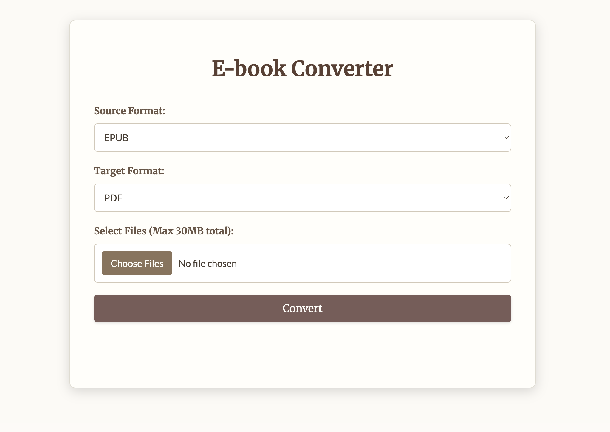

# Full-Stack E-book Converter Web App



This web application provides a user-friendly interface to upload e-book files (EPUB, MOBI, PDF), convert them to a selected target format, and download the results. It features a stylish, "bookish" theme for a pleasant user experience.

## Key Features

*   **Intuitive Web Interface:** Modern, clean, and "bookish" themed UI.
*   **Format Selection:** Supports PDF, EPUB, and MOBI as source and target formats.
*   **File Upload:** 
    *   Allows selection of one or multiple files.
    *   Client-side validation to ensure selected files match the chosen source format.
    *   Configurable maximum upload size (default: 30MB per request).
*   **Conversion Engine:** Utilizes Calibre's powerful `ebook-convert` command-line tool for reliable conversions.
*   **Output Management:**
    *   **Individual Downloads:** Direct download links for each successfully converted file.
    *   **Batch Downloads:** Bundles multiple converted files into a single ZIP archive named `converted_files.zip` (or `converted_files (n).zip` for duplicates).
*   **Status & Error Reporting:** Clear feedback on conversion progress, success, and any errors encountered.
*   **Session-Based File Handling:** Uploaded and converted files are managed in session-specific temporary directories.

## Technology Stack

*   **Backend:** Python, Flask
*   **Conversion:** Calibre (`ebook-convert` command-line tool)
*   **Frontend:** HTML, CSS, JavaScript
*   **Fonts:** Google Fonts (Merriweather for headings, Lato for body text)

## Prerequisites

1.  **Python 3.7+:** Ensure Python 3.7 or newer is installed. You can download it from [python.org](https://www.python.org/).
2.  **Calibre:** The core conversion functionality relies on the `ebook-convert` tool, which is part of the Calibre e-book management software.
    *   Download and install Calibre from its official website: [https://calibre-ebook.com/download](https://calibre-ebook.com/download).
    *   **Crucially, ensure that the directory containing `ebook-convert` is added to your system's PATH environment variable.** The application attempts to find it in common locations (e.g., `/Applications/calibre.app/Contents/MacOS/ebook-convert` on macOS), but having it in the PATH is the most reliable method. The application will show a warning on startup if `ebook-convert` cannot be found, and conversions will fail.
3.  **pip:** Python's package installer (usually comes with Python).

## Setup and Installation

1.  **Clone the Repository or Download Files:**
    ```bash
    # If this project were a Git repository:
    # git clone <repository_url>
    # cd <repository_name>
    ```
    Alternatively, download all project files (`app.py`, `book_converter_utils.py`, `requirements.txt`, `templates/index.html`, `static/style.css`, `static/script.js`) and place them in a single project directory.

2.  **Create and Activate a Virtual Environment (Highly Recommended):
    ```bash
    # Navigate to your project directory
    cd /path/to/your/project_directory

    # Create a virtual environment (e.g., named 'env')
    python3 -m venv env

    # Activate the virtual environment
    # On macOS/Linux:
    source env/bin/activate
    # On Windows (Git Bash or similar):
    # source env/Scripts/activate
    # On Windows (Command Prompt/PowerShell):
    # env\Scripts\activate.bat 
    ```

3.  **Install Python Dependencies:**
    With your virtual environment activated, install the required Python packages:
    ```bash
    pip install -r requirements.txt
    ```

4.  **Verify `ebook-convert` Installation (Optional but Recommended):
    Open your terminal (with the virtual environment activated if you use one for Calibre as well, though usually Calibre is system-wide) and type:
    ```bash
    ebook-convert --version
    ```
    If this command displays a version number, Calibre's tool is correctly installed and accessible in your PATH. If not, please revisit the Calibre installation prerequisite.

## Running the Application

1.  Ensure you are in the project directory in your terminal.
2.  Make sure your Python virtual environment is activated (if you created one).
3.  Start the Flask development server:
    ```bash
    python app.py
    ```
4.  The application will start. By default, it runs on `http://127.0.0.1:5001/`.
    Open this URL in your web browser to use the E-book Converter.

## How to Use the Web Interface

1.  **Open the Application:** Navigate to `http://127.0.0.1:5001/` in your browser.
2.  **Select Source Format:** Choose the format of the e-book files you intend to upload (PDF, EPUB, or MOBI).
3.  **Select Target Format:** Choose the format you want your files converted to.
4.  **Choose Files:** 
    *   Click the "Select Files" area.
    *   A file dialog will open. Select one or more e-book files from your computer that match the chosen "Source Format".
    *   The application has client-side validation to alert you if selected files don't match the source format.
5.  **Convert:** Click the "Convert" button to start the upload and conversion process.
6.  **Monitor Progress:** A status message will indicate that files are being processed.
7.  **Download Results:**
    *   Upon completion, a list of converted files will appear under "Converted Files:".
    *   Each successfully converted file will have an individual "Download" link.
    *   If multiple files were processed, a "Download All as ZIP" button will also be available. This will download a single archive named `converted_files.zip` (or `converted_files (1).zip`, etc., if the name is already taken in the server's `converted_files` directory).
    *   Any errors encountered during conversion for specific files will be listed under an "Errors:" section.

## Project Structure

```
. (project_root)
├── app.py                     # Main Flask application logic, routes
├── book_converter_utils.py    # Utility functions (find ebook-convert, file naming, conversion call)
├── requirements.txt           # Python package dependencies
├── README.md                  # This file - detailed project information
├── templates/
│   └── index.html             # HTML template for the main user interface
├── static/
│   ├── style.css              # CSS styles for the "bookish" theme
│   └── script.js              # Client-side JavaScript for form handling, AJAX, UI updates
├── uploads/                   # Root directory for temporary uploaded files (created automatically)
│   └── [session_id]/          # Session-specific subdirectories for uploaded files
└── converted_files/           # Root directory for converted files and ZIP archives (created automatically)
    └── [session_id]/          # Session-specific subdirectories for individual converted files
    └── converted_files (n).zip # ZIP archives for batch downloads
```

## Important Considerations & Limitations

*   **`ebook-convert` Dependency:** The application is fundamentally dependent on Calibre's `ebook-convert` tool. If it's not installed correctly or not found in the system PATH (or common alternative paths checked by the script), conversions will fail.
*   **Temporary File Management & Cleanup:** 
    *   Uploaded files are stored temporarily in `uploads/<session_id>/`.
    *   Converted files are stored in `converted_files/<session_id>/`.
    *   ZIP archives are stored directly in the `converted_files/` directory.
    *   **CRITICAL: This application, in its current state, does NOT implement automatic cleanup of these session-specific folders or the generated ZIP files.** Over time, these folders and files will accumulate and consume disk space. For a production or long-term deployment, a robust cleanup mechanism (e.g., a scheduled background job or manual periodic cleanup) is essential.
*   **File Size Limit:** The Flask application has a default maximum content length for uploads set to 30MB per request (see `app.config['MAX_CONTENT_LENGTH']` in `app.py`). This can be adjusted if needed.
*   **Error Handling:** The application provides basic error feedback to the user. Server-side logs (console output) will contain more detailed error messages from `ebook-convert` if issues occur.
*   **Development Server:** The application uses Flask's built-in development server (`app.run(debug=True)`). **This server is NOT suitable for production use.** For a production environment, deploy the application using a production-ready WSGI server (e.g., Gunicorn, uWSGI) typically behind a reverse proxy (e.g., Nginx).
*   **Security:** Basic security measures like `secure_filename` are used. For public-facing applications, further security hardening (e.g., input validation, rate limiting, CSRF protection if forms become more complex) would be necessary.
*   **Scalability:** This is a simple, single-process Flask application. For handling high traffic or a large number of concurrent conversions, a more scalable architecture would be required (e.g., using asynchronous task queues like Celery for conversions, multiple WSGI server workers).

## Customization

*   **File Size Limit:** Modify `app.config['MAX_CONTENT_LENGTH']` in `app.py`.
*   **Styling:** Update `static/style.css` and `templates/index.html` for UI changes.
*   **`ebook-convert` Path:** If `ebook-convert` is in a very non-standard location, you might need to adjust the `find_ebook_convert_path` function in `book_converter_utils.py`.

## License

This project is open-source. (You can add a specific license if you wish, e.g., MIT). 